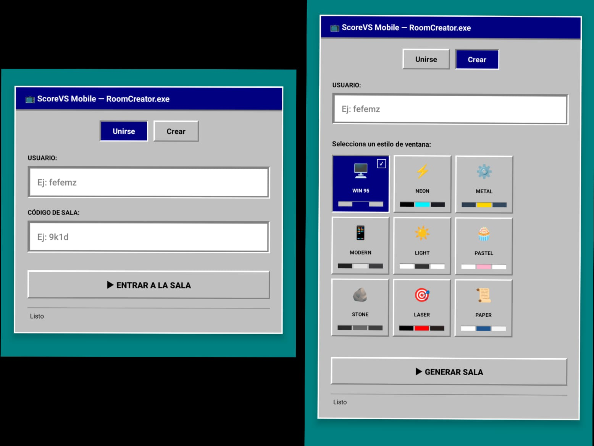
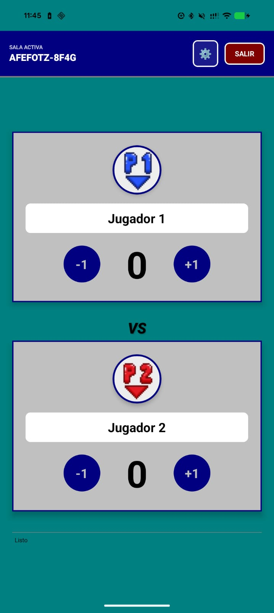
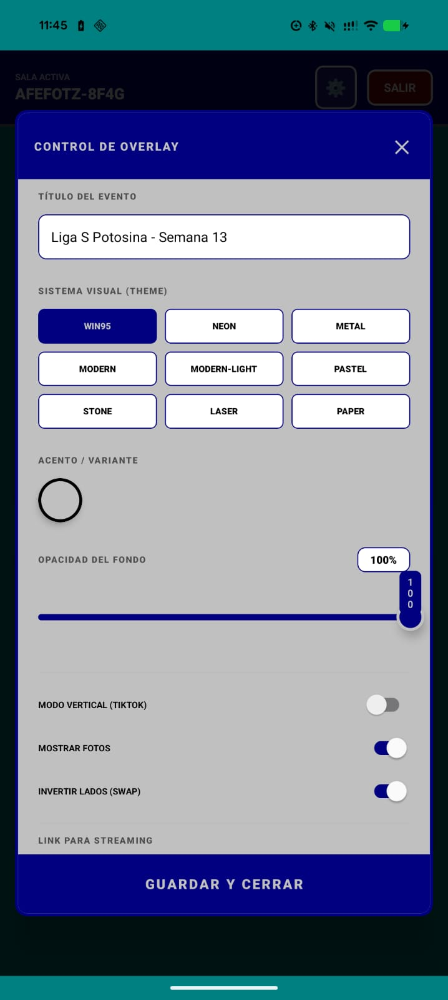
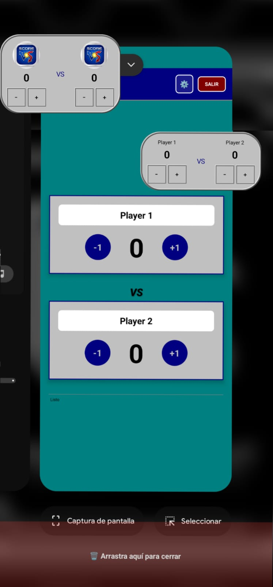

# 🎮 ScorevsApp

ScorevsApp es una avanzada aplicación móvil construida principalmente en **React Native**, pero que integra robustas capacidades nativas en **Java/Kotlin** para Android. Está orientada a la gestión de puntuaciones interactivas, perfiles de jugadores, estadísticas y personalización a través de un sistema de temas dinámicos sincronizados en tiempo real mediante Firebase.

---

## 📸 Vistazo Rápido

| Login | Dashboard | Configuración | Burbuja Flotante
|:---:|:---:|:---:|:---:|
|  |  |  | 

---

## ✨ Características Principales

* **Sistema de Salas en Tiempo Real (Create/Join):** Sincronización atómica mediante Firebase Realtime Database.
* **Temas Dinámicos en Tiempo Real:** 8 variaciones visuales (Win95, Neon, Metal, Modern, etc.) con transiciones limpias y sin residuos de renderizado.
* **Marcador OOB (Out-of-Bounds):** Implementación nativa de una burbuja flotante/Picture-in-Picture con soporte para gestos inteligentes (Doble Tap para regresar a la app).
* **Normalización Trans-plataforma:** Sincronización perfecta de variantes y temas entre la versión Web (OBS) y la App móvil.
* **Gestión de Jugadores:** Perfiles con fotos y nombres personalizables.
* **Gestión de Link para Streaming:** Generación y copiado automático del enlace de overlay para visualización web, facilitando la integración con OBS Studio y plataformas de transmisión.
* **Estilizado Nativo de Alta Fidelidad:** Motor nativo capaz de renderizar bordes, biseles 3D y colores CSS (rgba) con total paridad visual.
* **Configuración Avanzada:** Control granular de opacidad, orientación vertical (TikTok mode) y visibilidad de elementos decorativos.

---

## 🛠 Arquitectura Híbrida

El éxito de la funcionalidad de la burbuja flotante se debe a una arquitectura que combina lo mejor de ambos mundos:

* **Capa JavaScript (React Native + TS):** Gestiona la lógica de negocio, la navegación y la sincronización con Firebase aplicando principios de **Clean Architecture** para mantener el código modular, escalable y fácil de testear.
* **Capa Nativa (Java/Kotlin):** Crucial para el desarrollo del **FloatingScoreService**. Incluye un motor de renderizado dinámico que traduce tokens de diseño complejos (biseles Win95, scanlines Neon) a primitivas de Android.
* **Puente de Comunicación:** Se utiliza un sistema de `NativeModules` para disparar el overlay y `NativeEventEmitter` para devolver las interacciones. Además, implementa `GestureDetector` para funciones avanzadas de navegación.

---

## 🚀 Cómo Empezar (Para Desarrolladores)

### Prerrequisitos

* [Node.js](https://nodejs.org/en/)
* [JDK 17+](https://www.oracle.com/java/technologies/downloads/) (Necesario para la compilación Kotlin/Java)
* [Android SDK / Herramientas de línea de comandos](https://developer.android.com/studio)
* [React Native Environment Setup](https://reactnative.dev/docs/set-up-your-environment)

### Instalación y Ejecución

1.  **Dependencias:** Ejecuta `npm install` o `yarn install`.
2.  **Firebase:** Renombra el archivo `android/app/google-services.json.example` a `google-services.json` y coloca tus credenciales válidas.
3.  **Metro Bundler:** Inicia el servidor con `npm start`.
4.  **Lanzamiento:** Ejecuta `npm run android` para compilar e instalar en tu dispositivo/emulador.

---

## 🔧 Configuración para Ambientes de Producción

Para compilar versiones firmadas, configurar en tu archivo `gradle.properties` global:
* `MYAPP_UPLOAD_STORE_FILE`
* `MYAPP_UPLOAD_KEY_ALIAS`
* `MYAPP_UPLOAD_STORE_PASSWORD`
* `MYAPP_UPLOAD_KEY_PASSWORD`

---

## 🫧 Marcador Flotante (Android Configuration)

### Para el Usuario
* **Permiso Overlay:** Es obligatorio conceder "Mostrar sobre otras aplicaciones" al primer inicio o desde los ajustes del sistema.
* **Batería:** Configure la app como "Sin restricciones" para asegurar que la burbuja no sea eliminada por el sistema operativo en sesiones largas de juego.

### Para el Desarrollador
* El código nativo se encuentra en `android/app/src/main/java/com/scorevsapp/`.
* Se utiliza un `Foreground Service` con tipo `specialUse` para garantizar la persistencia del marcador mientras la app está minimizada.

---

## 📖 Manual de Uso (Integración con OBS/PRISM)

1.  Ejecuta la App y crea una sala.
2.  Desde el ícono de configuración, copia el enlace generado en el campo "Enlace para streaming".
3.  Abre OBS Studio o PRISM Live Studio.
4.  Añade una nueva fuente de tipo **Navegador (Browser Source)**.
5.  Pega el enlace, ajusta el ancho a `500` y el alto a `300` (o ajusta según tu preferencia o layout).
6.  ¡Listo! Abre el panel de administración en tu celular y controla el stream a distancia en tiempo real.

---

## 👨‍💻 Sobre el Autor

Desarrollador de software con sólida experiencia en programación y arquitectura de sistemas. Enfocado en crear herramientas web y móviles eficientes, reactivas y con arquitecturas escalables que resuelven problemas reales.

---
*Hecho con dedicación para la comunidad de Pump It Up.*